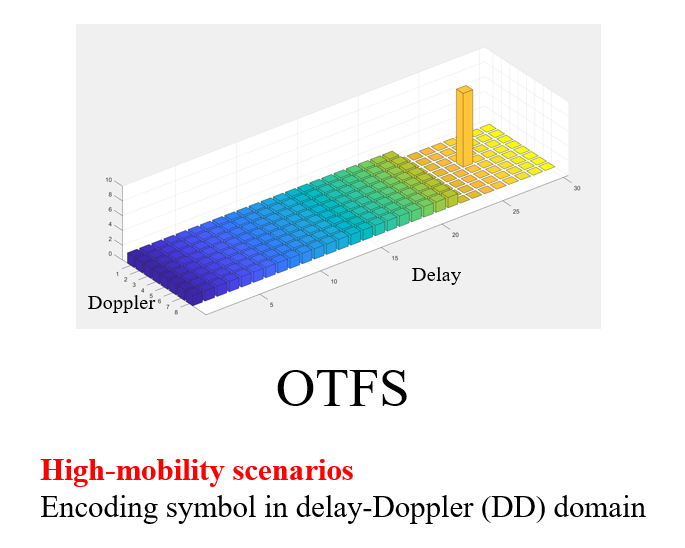
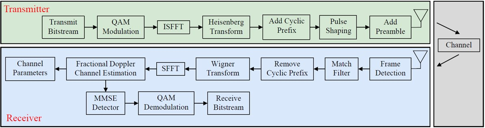
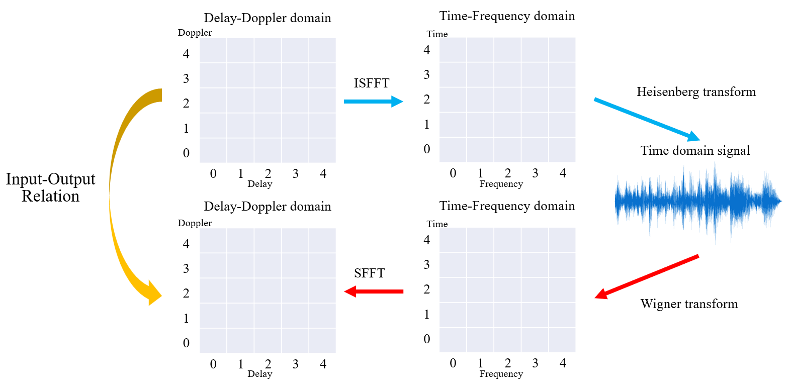
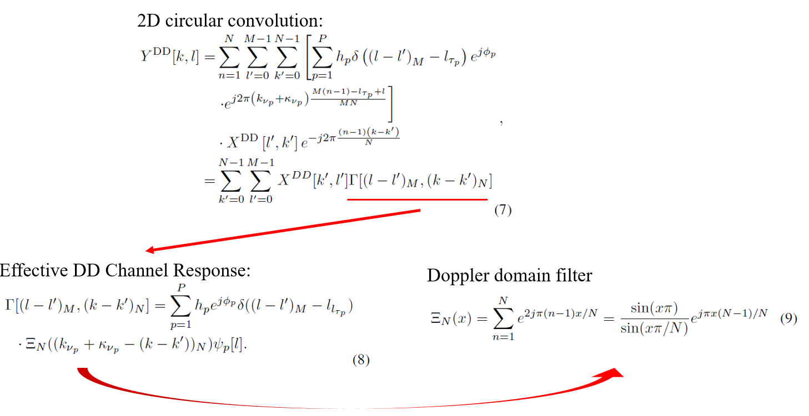
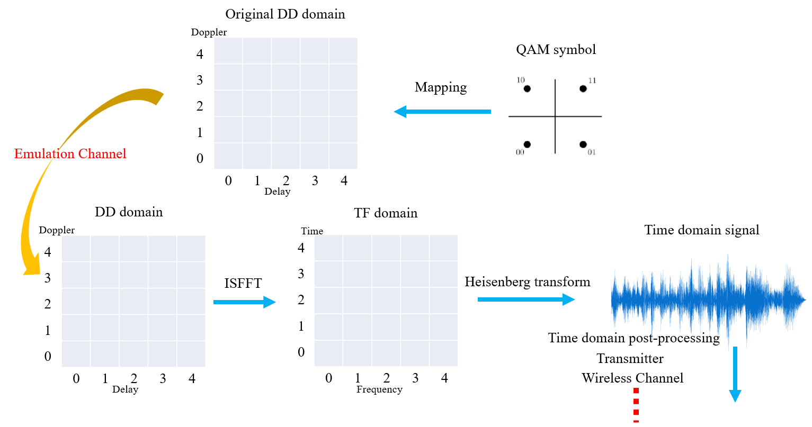

# OTFS SDR Implementation with Channel Emulator
This is a code package for WCNC 2023 conference paper "SDR System Design and Implementation on Delay-Doppler Communications and Sensing"

_Only SDR transceiver and signal generation design is giving in this project, the channel estimation and signal detection are given in the other project!_

## Introduction
The orthogonal time frequency space (OTFS) technique is a promising modulation scheme with great advantages in channel delay and Doppler shifts. OTFS technique adopts a novel two-dimensional (2D) modulation technique that encodes information symbols in the delay-Doppler (DD) domain instead of the conventional time-frequency (TF) domain

## System Model
The first transceiver are control by MATLAB respectively, there is a LABVIEW-version transceiver control code.

## Channel Input-Output Relation
Before introducing pilot base Delay-Doppler channel emulator, we need to explain the DD domain input-output relation. As mentioned in the previous slides, after applying inverse symplectic FFT and Heisenberg transform to the DD domain, we can acquire time domain signal. Then the time domain signal interfered by the wireless channel and carry the channel state information. 

To inverse this process, we can apply wigner transform and symplectic FFT. However, instead of computing the complex time domain channel response and the domains transform, using DD domain input-output relation directly is computation-saving and more straightforward. 

The DD domain input-output relation is basically the 2D circular convolution between input DD grid $X^{\rm DD}$ and effective DD domain channel response $\Gamma$.  
The channel response consists of channel gain $h$, Initial phase $\phi$, and delay $l$ and doppler $k$ index of each path $p$

We use $\Gamma$ to represent the channel response and use $\Xi$ to represent doppler domain filter. 
The magnitude of the $\Xi$ just like the $sinc$ function. The non-integer point is non-zero, that is why the fractional doppler 
Will spread the power to the entire doppler taps.

## Channel Emulator
After original DD grid is created, we  apply the emulation channel to generate emulated targets on the DD domain, 
Then we apply inverse symplectic FFT and Heisenberg transform to  the emulated DD grid to obtain time domain signal
Finally giving some post-processing then transmit the signal to the wireless channel 

Emulated result

## Codes Citation
- N. Hashimoto, N. Osawa, K. Yamazaki and S. Ibi, "[*Channel Estimation and Equalization for CP-OFDM-based OTFS in Fractional Doppler Channels*](https://ieeexplore.ieee.org/abstract/document/9473532)," 2021 IEEE International Conference on Communications Workshops (ICC Workshops), 2021, pp. 1-7, doi: 10.1109/ICCWorkshops50388.2021.9473532.
- Noriyuki HASHIMOTO, et al., "[*Channel Estimation and Equalization for CP-OFDM-based OTFS in Fractional Doppler Channels*](https://arxiv.org/abs/2010.15396)," arXiv:2010.15396v3 [cs.IT], Jan. 2021.